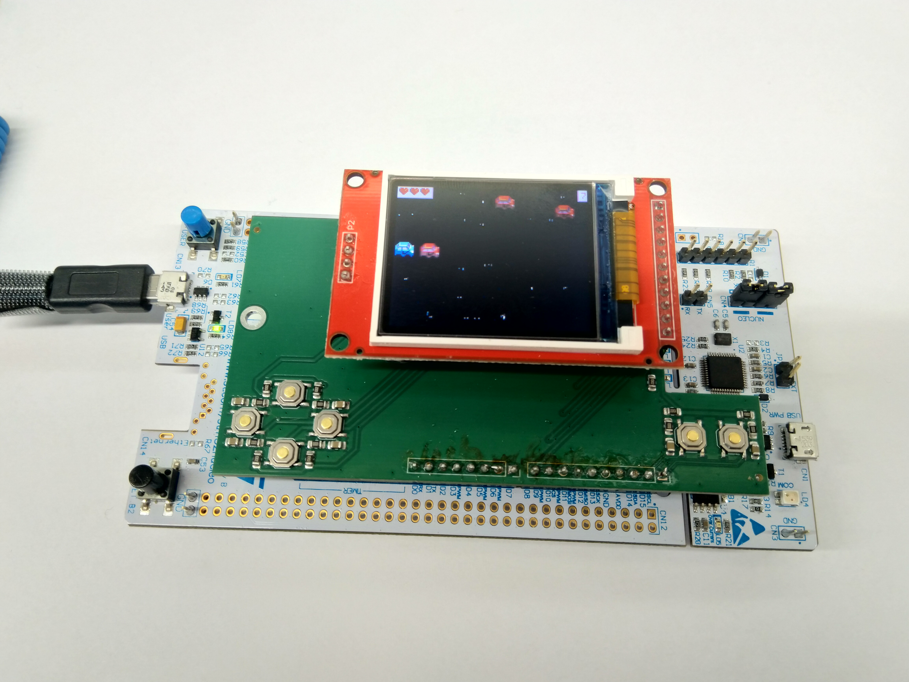
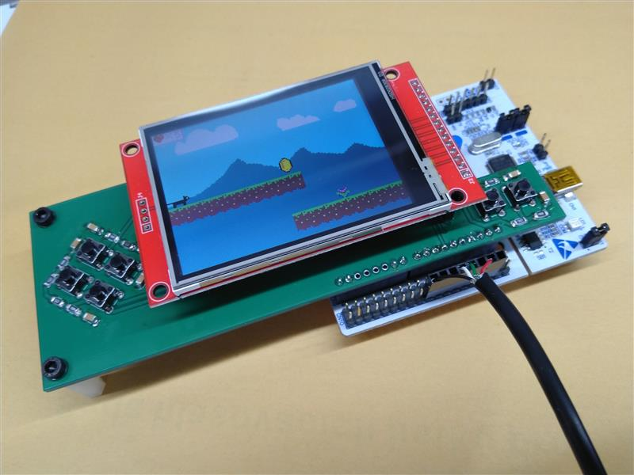

# Game console shield for NUCLEO-F412ZG

It is intended for [MakeCode Arcade](https://arcade.makecode.com/) as F4 target (see available material on (https://arcade.makecode.com/hardware/adding) if you wish to customize),

with additional lcd module ST7735: 
- (https://www.laskakit.cz/128x160-barevny-lcd-tft-displej-1-8--spi/)

Available are bootloader firmware binaries:
- in "bootloaders" directory

There is available kicad project for the board:
- in "pcb" directory
- in "pcb-symbols" directory are symbols (one Arduino community CC licensed)

A sample box can be found in "box" directory

There are available workshop slides ("Postav a naprogramuj si vlastní herní konzoli s.pdf") for Maker Faire in Prague 2026 (in czech language) that describe "getting started" process. 

There are also available workshop materials for Maker Faire in Brno 2025 where used NUCLEO-F411RE/NUCLEO-F401RE -- please see releases section. 

